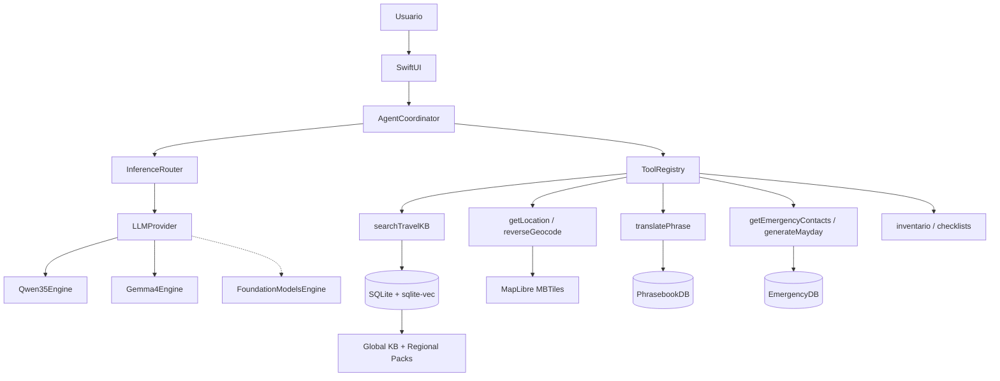

# Ultramar AI — Visión de sistema (síntesis)

> Consolidado desde investigación + **decisiones cerradas** en [`decisions/`](./decisions/)

## Qué es

**Ultramar AI** — *Offline travel assistant*. App iOS **100 % offline** para viajar sin red: traducir, leer fotos, chat con contexto local, frases curadas. LLM local + **RAG + tools + datos curados**.

Tailandia = primer **regional pack** dogfood; producto **global**.

Marca: [ADR-003](./decisions/003-brand-ultramar.md) · Bundle `com.felipebasurto.ultramar`

---

## Stack acordado (**cerrado** — ver [ADR-001](./decisions/001-llm-stack-locked.md))

| Capa | Decisión | Doc |
|------|----------|-----|
| **LLM cerebro** | **Qwen3.5-4B-Instruct** Q4_K_M (~2.7 GB) | [001](./decisions/001-llm-stack-locked.md), [10](./research/10-qwen-ecosystem-huggingface.md) |
| **LLM sentidos** | **Gemma-4-E2B-it** (8 GB) / **E4B** (Pro 12 GB) | [001](./decisions/001-llm-stack-locked.md), [09](./research/09-comparativa-detallada-qwen-llama-gemma.md) |
| **Bonus sistema** | Apple Foundation Models (iOS 26) opcional | [004](./decisions/004-hybrid-apple-intelligence-edge.md), [11](./research/11-ios-llm-frameworks.md) |
| **RAG** | multilingual-e5-small + SQLite + sqlite-vec + FTS5 + RRF | [02](./research/02-rag-embeddings.md) |
| **Agente** | AgentCoordinator Swift (ReAct, max 5 pasos, guardrails) | [03](./research/03-tool-calling-agents.md) |
| **Mapas** | MapLibre + MBTiles OSM | [04](./research/04-offline-maps-geocoding.md) |
| **Traducción** | Phrasebook curado + Apple Translation opcional | [05](./research/05-offline-translation.md) |
| **Visión** | Gemma 4 (fase 1.1) | [06](./research/06-multimodal-vision.md) |
| **Contenido** | Pack global + regional packs | [07](./research/07-survival-kb-sources.md) |
| **Emergencias** | EmergencyDB SQLite | [08](./research/08-emergency-data-worldwide.md) |
| **Negocio** | Gratis (dogfood → Tailandia); monetización post-viaje | [002](./decisions/002-product-business-decisions.md) |

---

## Arquitectura



---

## Principios de diseño (no negociables)

1. **RAG antes que parametric knowledge** en temas médicos, fauna venenosa, agua potable.
2. **Frases de emergencia curadas**, nunca traducción LLM libre para SOS.
3. **Estado estructurado** (inventario, ubicación, situación) en SwiftData/SQLite, no solo en el contexto del LLM.
4. **Regional packs descargables** — global core embebido (~100 MB KB), regiones bajo demanda.
5. **Disclaimers visibles** — informa, no sustituye servicios de emergencia ni médicos.
6. **Un motor pesado a la vez** — no LLM 3B + VLM simultáneos en 8 GB RAM.
7. **Safety secundario** — modo SOS existe; el hero es travel assistant offline.
8. **Apple Intelligence = bonus** — FM nunca sustituye edge en agente, RAG crítico o visión ([ADR-004](./decisions/004-hybrid-apple-intelligence-edge.md)).

---

## Tools MVP

| Tool | Prioridad |
|------|-----------|
| `searchTravelKB` | P0 |
| `getEmergencyContacts` | P0 |
| `translatePhrase` | P0 |
| `getLocation` | P0 |
| `generateMayday` | P0 |
| `getChecklist` | P0 |
| `logInventory` / `getInventory` | P1 |
| `reverseGeocodeOffline` | P1 |
| `getCachedWeather` | P1 |
| `logSituation` | P1 |
| `identifyFromPhoto` | P2 (fase 2) |

---

## Regional packs

```
pack-global-core/     # embebido en app
├── kb/universal/
├── emergency.json    # ITU base + instrucciones genéricas
└── phrasebook/       # EN, ES, FR, DE, AR, ZH mínimo

pack-{region}/        # descarga WiFi pre-viaje
├── kb/               # fauna, clima, plantas locales
├── emergency.json    # números país + servicios
├── phrasebook/       # idiomas locales
├── geonames.sqlite   # reverse geocode capa 2
└── meta.json         # bbox, versión, bioma
```

Mapas MBTiles = pack separado (puede ser GB por región).

---

## Fases de implementación

| Fase | Entregable | Semanas |
|------|------------|---------|
| **0** | Research docs (hecho) | ✓ |
| **1** | Xcode + LLM chat offline + UI mínima | 1–2 |
| **2** | RAG + AgentCoordinator + tools P0 | 3–4 |
| **3** | MapLibre + EmergencyDB + phrasebook + regional packs | 5–6 |
| **4** | Modo Safety + test avión + pack primera región | 7–8 |
| **5** | Visión (SmolVLM + clasificadores Core ML) | post-viaje |

---

## Huella estimada (iPhone 17, 8 GB)

| Componente | Tamaño |
|------------|--------|
| App + global KB | ~150–250 MB |
| LLM Qwen3.5-4B Q4 | ~2.7 GB |
| LLM Gemma 4-E2B Q4 (opcional) | ~2.6 GB |
| Embeddings E5-small | ~120 MB |
| Índice vectorial (~10K chunks) | ~40–80 MB |
| Regional pack (sin mapas) | ~50–200 MB |
| Mapas MBTiles (opcional) | 500 MB – 2 GB |
| VLM fase 2 (opcional) | ~0.5–1.5 GB |

**Total típico pre-viaje:** ~2.5–3 GB (sin mapas grandes).

---

## Referencias cruzadas

- [01 — Modelos LLM locales](../research/01-local-llm-models.md)
- [02 — RAG y embeddings](../research/02-rag-embeddings.md)
- [03 — Tool calling y agentes](../research/03-tool-calling-agents.md)
- [04 — Mapas offline y geocoding](../research/04-offline-maps-geocoding.md)
- [05 — Traducción offline](../research/05-offline-translation.md)
- [06 — Multimodal / visión](../research/06-multimodal-vision.md)
- [07 — Fuentes KB supervivencia](../research/07-survival-kb-sources.md)
- [08 — Datos de emergencia worldwide](./research/08-emergency-data-worldwide.md)
- [09 — Comparativa Qwen vs Llama vs Gemma](./research/09-comparativa-detallada-qwen-llama-gemma.md)
- [10 — Ecosistema Qwen (Hugging Face)](./research/10-qwen-ecosystem-huggingface.md)
- [11 — Frameworks iOS LLM (Apple + llama.cpp)](./research/11-ios-llm-frameworks.md)
- [ADR-004 Híbrido Apple Intelligence + edge](./decisions/004-hybrid-apple-intelligence-edge.md)
- [ADR-005 Model download workflow (Phase 1)](./decisions/005-model-download-workflow.md)
- [ADR-006 Qwen final-only + thinking debug](./decisions/006-qwen-thinking-visibility.md)
- [ADR-007 CLI + inference harness](./decisions/007-cli-inference-harness.md)
- [ADR-008 Product chat session parity (app ↔ CLI)](./decisions/008-product-chat-session-parity.md)
- [ADR-009 Local chat backend revamp](./decisions/009-local-chat-backend-revamp.md)
- [LLM routing (arquitectura)](./architecture/llm-routing.md)
- [Chat inference harness (app + CLI)](./architecture/chat-inference-harness.md)
- [Decisiones de negocio](./decisions/002-product-business-decisions.md)
- [ADR-001 LLM stack](./decisions/001-llm-stack-locked.md)

---

## Próximo paso

Integrar `swift-llama` en `UltramarLLM` + descarga Qwen3.5 Q4 ([ADR-001](./decisions/001-llm-stack-locked.md)).

Greenfield harness: `make bootstrap`, `make build`, `make test` — ver [README](../README.md) y [AGENTS.md](../AGENTS.md).

**Marca:** [ADR-003 Ultramar AI](./decisions/003-brand-ultramar.md) — App Store: *Ultramar AI: Offline travel assistant*
