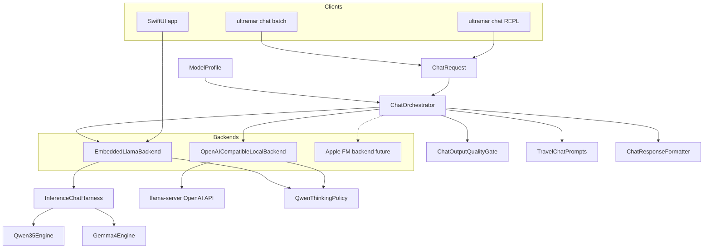

# Chat inference harness (app + CLI)

> **Routing (which backend):** [llm-routing.md](./llm-routing.md)  
> **Thinking policy:** [ADR-006](../decisions/006-qwen-thinking-visibility.md)  
> **Session parity:** [ADR-008](../decisions/008-product-chat-session-parity.md)  
> **CLI commands:** [ADR-007](../decisions/007-cli-inference-harness.md)

---

## Purpose

One shared contract for **travel chat** in the SwiftUI shell and the macOS `ultramar` CLI. As of [ADR-009](../decisions/009-local-chat-backend-revamp.md), the contract is `ChatBackend` + `ChatOrchestrator`:

- macOS CLI/dev defaults to `OpenAICompatibleLocalBackend` (`llama-server` at `http://127.0.0.1:8080/v1`).
- iOS/app debug keeps the embedded llama.cpp path through `EmbeddedLlamaBackend` and `InferenceChatHarness`.
- `ChatOrchestrator` owns quality gate, hidden-reasoning handling, and final-only retry.

**Invariant:** App embedded inference remains offline and keeps Qwen XOR Gemma loaded. CLI prompt iteration should use server mode by default; use `--backend embedded` only for iOS parity/debug.

**Not in harness today:** RAG-augmented critical KB in chat thread, AgentCoordinator tool loops (routing separately per [llm-routing.md](./llm-routing.md)).

---

## Flow



---

## CLI — product mode (canonical)

Start the local server once, then connect the CLI:

```bash
make cli-build
make qwen-server
Packages/UltramarCLI/.build/release/ultramar chat --backend server --engine qwen
```

Server mode expects `llama-server` to expose `/v1/chat/completions`. `/new` clears session; `/system <file>` changes the system prompt for the REPL; `/exit` quits. The model stays loaded in the server process, not inside `ultramar`.

| Stream | Contenido |
|--------|-----------|
| **stdout** | Respuesta final por turno; streaming solo si se activa explícitamente para debug |
| **stderr** | Banner, prompt `>`, timing por turno |

---

## CLI — dev / server one-shot

```bash
make cli-build
Packages/UltramarCLI/.build/release/ultramar chat \
  --backend server \
  --prompt "¿Consejos para viajar a Tailandia sin datos?" \
  --engine qwen
```

| Stream | Contenido |
|--------|-----------|
| **stdout** | Solo la respuesta final (texto del viajero) |
| **stderr** | `Loading model…` durante la carga; tras la respuesta, `Timing: load … \| generate … \| total …` (tok/s si hay tokens) |

Ejemplo stderr tras chat:

```text
Timing: load 42.1s | generate 23.4s (847 tokens, 36.2 tok/s) | total 65.5s
```

Si `--engine auto` sin preload, el segmento `load` se omite. Con `--format json`, los mismos campos van en el objeto JSON además de la línea stderr.

Si el server no está levantado, el CLI falla rápido con un error de conexión y el hint `make qwen-server`. Para depurar el backend embebido:

```bash
GGML_LOG_LEVEL=error Packages/UltramarCLI/.build/release/ultramar chat \
  --backend embedded \
  --engine qwen \
  --interactive
```

**Ruido llama.cpp:** `GGML_LOG_LEVEL=error` silencia spam Metal en stderr. No sustituye `LlamaCppLogging.ensureQuiet()` en unload (ver abajo).

---

## CLI — flags (`ultramar chat`)

| Flag | Default | Uso |
|------|---------|-----|
| `--backend` | `server` | `server` para `llama-server`; `embedded` para llama.cpp en proceso |
| `--base-url` | `http://127.0.0.1:8080/v1` | Base URL OpenAI-compatible |
| `--prompt` | — | Entrada única; **repetir** para batch |
| `--prompts-file` | — | Un prompt por línea (`#` comentarios) |
| `--stdin` / `--stdin-lines` | — | Un prompt (stream entero) o uno por línea |
| `--interactive` / `-i` | TTY sin prompts | Product REPL (`sendInSession`); `/new`, `/exit`, `/help` |
| `--engine` | `auto` | Product: **requiere** `qwen` o `gemma`. Dev one-shot: carga + routing |
| `--unload` | off | Alias histórico; el REPL descarga limpiamente al salir |
| `--task` | `generalChat` | `AgentTask` para `InferenceRouter` |
| `--model-path` | — | GGUF explícito; solo `--backend embedded` |
| `--system-prompt-file` | — | System prompt UTF-8 para iterar sin recompilar |
| `--keep-loaded` | off | Alias histórico; usar REPL/batch para evitar recargas |
| `--show-thinking` | off | Incluir bloques think en salida formateada |
| `--stream` | off | Emitir tokens visibles en vivo (puede mostrar basura intermedia) |
| `--verbose` | off | Sección `--- Thinking ---` en stderr (requiere `--show-thinking`) |
| `--progress` | off | Contador de tokens en stderr (debug) |
| `--fast` | off | Alias histórico; final-only `/no_think` ya es el default |
| `--thinking` | off | Modo debug con `/think`; puede mostrar thinking si se pide |
| `--format` | `text` | `json` para agentes (`load_duration_ms`, `duration_ms`, `total_duration_ms`, `tokens_generated`, `tokens_per_second`, …) |

**No usar en producción / demos:** `--fast`, `--progress`, `--stream` (salvo depuración).

**Histórico:** `--stream` existía como flag obligatorio; ahora el streaming es opt-in. Pasar `--stream` sin valor sigue siendo válido (alias).

`make qwen-server`: valida que `llama-server` exista, que el GGUF de Qwen esté instalado, y levanta el servidor foreground. `--backend embedded` mantiene el comportamiento histórico: carga Qwen/Gemma dentro del proceso CLI y descarga antes de salir.

---

## Key types

| Type | Module | Role |
|------|--------|------|
| `ChatBackend` | UltramarLLM | Contrato común server/embedded |
| `ChatOrchestrator` | UltramarLLM | Selección, quality gate, retry final-only |
| `OpenAICompatibleLocalBackend` | UltramarLLM | Cliente `/v1/chat/completions` para `llama-server` |
| `EmbeddedLlamaBackend` | UltramarLLM | Adapter sobre `InferenceChatHarness` |
| `InferenceChatHarness` | UltramarLLM | Engines embebidos + `send`, `sendInSession`, `loadQwenBrain`, `unloadAll` |
| `ChatSession` | UltramarLLM | Multi-turn turns, truncate, `clear()` |
| `ChatTurn` | UltramarLLM | User/assistant message in session |
| `ProductChatProfile` | UltramarLLM | Frozen product defaults (app + CLI product) |
| `SendResult` | UltramarLLM | `answer`, `thinking?`, `task`, `backend`, `providerLabel`, `tokensGenerated`, `durationMs` |
| `TravelChatPrompts` | UltramarLLM | System prompts worldwide-travel (Qwen / FM / Gemma) |
| `ChatPresentation` | UltramarLLM | `showThinking`, `qwenReasoningMode`, `systemPromptOverride` |
| `QwenStructuredOutput` | UltramarLLM | Salida estructurada Qwen |
| `QwenThinkingPolicy` | UltramarLLM | Think blocks, streaming filter, finalize, recuperación |
| `ChatResponseFormatter` | UltramarLLM | `--- Thinking ---` / cuerpo respuesta |
| `LlamaCppLogging` | UltramarLLM | Callback `llama_log_set`; quiet por defecto |
| `LlamaTokenPiece` | UltramarLLM | Decode UTF-8 de `llama_token_to_piece` |
| `CLITimingSummary` | UltramarCLI | Footer stderr + campos JSON (load, inferencia, total, tok/s) |
| `InstallSnapshot` | UltramarLLM | `qwenInstalled`, `gemmaInstalled` para routing sin load |

---

## Travel chat prompts

`TravelChatPrompts` centraliza instrucciones de asistente de viaje offline (mundo, no solo Tailandia).

| Variant | Cuándo | Respuesta pedida al modelo |
|---------|--------|----------------------------|
| `qwenFinalOnly` | App/CLI product default | Solo respuesta final; no thinking visible ni oculto; `/no_think` |
| `qwenThinking` | Debug explícito (`--thinking` / toggle app) | Permite think block y lo oculta salvo `showThinking` |
| `foundationModels` | Backend FM | Misma idea sustantiva en idioma del usuario |
| `gemmaChat` / `gemmaVision` | Gemma texto / visión | Alineado con viaje offline |

Selección Qwen: `variantForQwen(reasoningMode:)` → final-only por defecto; thinking solo bajo debug explícito.

---

## Qwen generation path

1. `TravelChatPrompts.systemMessage` o `systemPromptOverride` + `QwenThinkingPolicy.userMessageForInference` (`/no_think` o `/think`).
2. Chat template llama.cpp → tokenización exacta → truncado de historial hasta que `promptTokens + maxTokens < n_ctx`.
3. Sampler chain Qwen (`top_k`, `top_p`, `min_p`, penalties, temperature, dist) → generación token a token.
4. `finalizeGeneration(...)` → `ChatOutputQualityGate`; si falla, retry único en final-only.

### Token budgets (`LlamaLoadPolicy.maxGenerationTokens`)

| Contexto | `thinking` | `finalOnly` |
|----------|-------------------|-------------------|
| Dispositivo real | **1536** | **512** |
| Simulador | 96 | 96 |

Thinking y “Thinking Process” en markdown consumen tokens antes de la respuesta visible.

### Streaming filter

`GenerationFilter` (por token):

- Separa thinking (`extractThinkingContent`) vs visible (`visibleAnswer`).
- No emite en stream ecos de la pregunta del usuario (prefijo o match normalizado).
- Aplica `sanitizeFinalAnswer` antes de cada delta.

### Finalize y calidad de respuesta

| Paso | Comportamiento |
|------|----------------|
| `sanitizeFinalAnswer` | Rechaza eco de instrucciones del system prompt, eco de la pregunta, metadatos (“Review Constraints”, “Thinking Process”, …) |
| `visibleAnswer` + cierre sintético `&lt;/think&gt;` | Si EOS cortó dentro de think XML |
| `fallbackAnswerFromThinking` | Citas entrecomilladas en thinking (con filtros meta) |
| `extractPlannedReplyFromThinking` | Si la respuesta visible es **corta** (&lt;140 chars) o meta, extrae viñetas tras marcadores `Reply:` / `Drafting content` en thinking tipo markdown |
| Vacío tras todo | `generationFailedMessage` (español): sugiere reintentar; CLI menciona `--thinking` solo para depurar |

**Problema conocido:** Qwen a veces ignora `&lt;/think&gt;` y escribe “Thinking Process:” en texto plano hasta el límite de tokens; la recuperación de viñetas mitiga respuestas vacías o de una línea, no sustituye un borrador completo si el modelo no llegó a redactar tips.

### Presentación

| Cliente | `ChatPresentation` | Salida |
|---------|-------------------|--------|
| App | Toggle *Show model thinking* | Hilo multi-turn + sección thinking opcional |
| CLI product | final-only | stdout por turno al final de la generación |
| CLI dev default | final-only | stdout = solo `answer` (formateado sin thinking) |
| CLI `--thinking` | thinking debug | thinking extraíble con `--show-thinking` |
| CLI `--show-thinking` | `showThinking: true` | stderr o JSON con thinking |

---

## Logging

| Permitido | Prohibido |
|-----------|-----------|
| `chat_send`, `chat_completed`, `inference_*` con contadores (`prompt_chars`, `tokens_generated`, `duration_ms`, `answer_chars`) | Texto de prompts, KB, thinking o respuesta completa |

Categorías `UltramarLog`: `engine`, `app`, `routing` (ver AGENTS #8).

Unload: `LlamaCppLogging.ensureQuiet()` + `StderrSilencer` en CLI durante `unloadAll()` para evitar volcado Metal al salir.

---

## Tests

| Suite | Qué cubre |
|-------|-----------|
| `ChatSessionTests` | Defaults de `ProductChatProfile`, truncado, clear, `sendInSession` requires loaded engine |
| `SamplingAndQualityTests` | Presets Qwen exactos y quality gate |
| `TravelChatPromptsTests` | Variantes y texto sustantivo |
| `InferenceChatHarnessSendResultTests` | `displayText` |
| `Qwen35IntegrationTests` | GGUF local opcional; Tailandia sin datos, español en respuesta |
| `LlamaLoadPolicyTests` | Presupuestos simulator vs device |

CI: tests de integración Qwen se omiten si no hay GGUF en `Application Support/UltramarAI/models/`.

---

## Troubleshooting

| Síntoma | Causa probable | Acción |
|---------|----------------|--------|
| `Unknown option '--stream'` | CLI antiguo | `make cli-build`; streaming ya no es flag obligatorio |
| Respuesta en inglés cuando el usuario escribió español | Binario viejo, prompt custom débil o modelo rechazado/reintentado | Rebuild; probar `/system reset`; revisar `--system-prompt-file` |
| Repite la pregunta, roles o system prompt | Quality gate debería bloquearlo | Rebuild; si se reproduce con binario actual, guardar prompt mínimo y abrir bug |
| Puntos `....` o texto parcial en stdout | `--stream` debug | Quitar `--stream` (default imprime solo al final) |
| Cada pregunta tarda otra carga completa | Uso de one-shot en bucle | Usar `ultramar chat --engine qwen` o `make batch PROMPTS_FILE=...` |
| `Model decode failed` + assert Metal | Estado roto ggml-metal tras crash previo | Cerrar terminal, reintentar; no es lógica harness |
| `Local model output failed quality checks (...)` | Dos generaciones rechazadas por guardrails | Probar `/new`, `/system reset` o simplificar prompt custom |
| Solo `Loading model…` y nada más | Modelo no instalado | `ultramar models download --engine qwen` |

---

## Maintenance checklist

1. Cambiar routing / FM fallback → `InferenceChatHarness` + [llm-routing.md](./llm-routing.md).
2. Cambiar prompts → `TravelChatPrompts.swift` + tests.
3. Cambiar think/visible/recovery → `QwenThinkingPolicy.swift` + tests.
4. Cambiar flags CLI → `ChatCommand.swift` + [ADR-007](../decisions/007-cli-inference-harness.md).
5. Comportamiento visible usuario → [ADR-006](../decisions/006-qwen-thinking-visibility.md) y esta doc.
6. Verificar: `make test` (salida real, no asumir verde sin correr).

---

## Code map

| File | Responsibility |
|------|----------------|
| `Packages/UltramarLLM/.../ChatSession.swift` | Session + truncate |
| `Packages/UltramarLLM/.../ProductChatProfile.swift` | Product defaults |
| `Packages/UltramarLLM/.../InferenceChatHarness.swift` | `send`, `sendInSession`, providers, `SendResult` |
| `Packages/UltramarLLM/.../TravelChatPrompts.swift` | System prompts |
| `Packages/UltramarLLM/.../QwenThinkingPolicy.swift` | Thinking + answer policy |
| `Packages/UltramarLLM/.../Qwen35Engine.swift` | Load/generate structured |
| `Packages/UltramarLLM/.../LlamaLoadPolicy.swift` | GPU layers, token caps |
| `Packages/UltramarLLM/.../LlamaCppLogging.swift` | llama log callback |
| `Packages/UltramarCLI/.../ChatCommand.swift` | CLI entry |
| `Packages/UltramarCLI/.../StreamOutputState.swift` | `--stream` stdout |
| `Packages/UltramarCLI/.../CLIProgressReporter.swift` | `--progress` |
| `Packages/UltramarCLI/.../ChatInteractiveLoop.swift` | Product REPL |
| `UltramarAI/ContentView.swift` | App `sendInSession` + chat thread |
