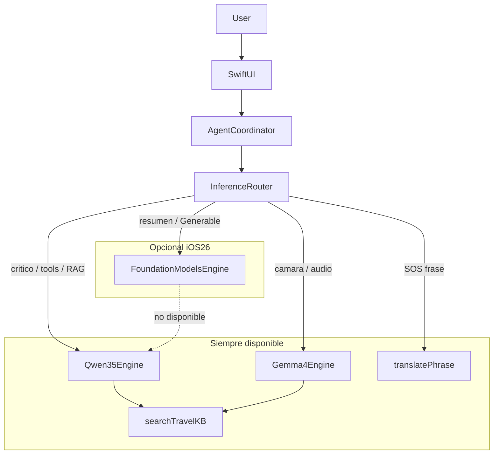
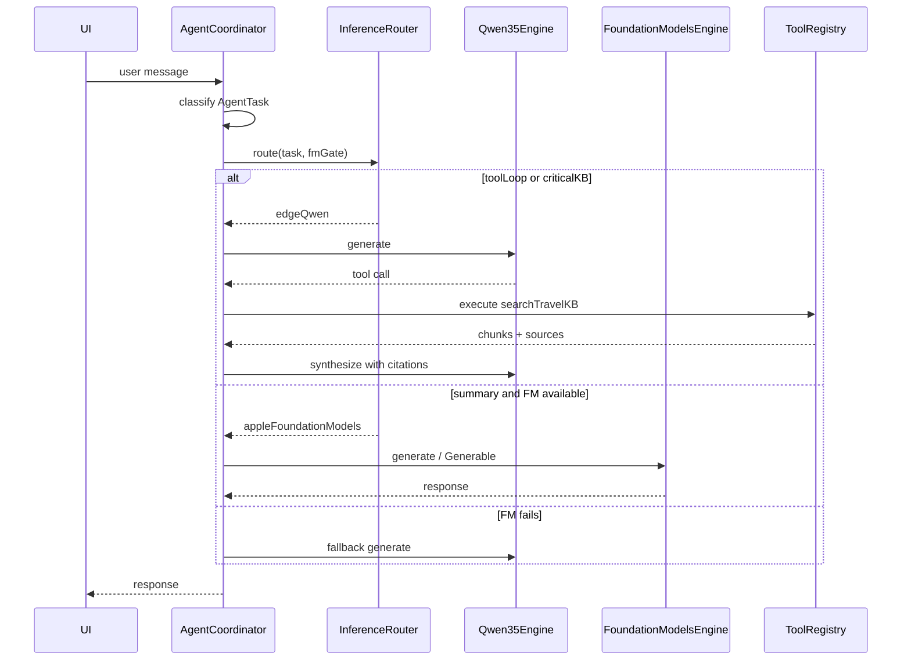

# LLM routing — Apple Intelligence + edge engines

> **ADR:** [004-hybrid-apple-intelligence-edge](../decisions/004-hybrid-apple-intelligence-edge.md)  
> **Research:** [11-ios-llm-frameworks](../research/11-ios-llm-frameworks.md)

---

## Arquitectura



---

## Backends

| Backend | Enum | Modelo | Cuándo |
|---------|------|--------|--------|
| Edge cerebro | `edgeQwen` | Qwen3.5-4B GGUF | Agente, tools, chat, RAG synthesis |
| Edge sentidos | `edgeGemma` | Gemma-4-E2B GGUF (+ mmproj) | Foto, audio |
| Apple bonus | `appleFoundationModels` | Sistema ~3B | Resúmenes, `@Generable`, polish |
| Curado | `phrasebook` | SQLite | SOS, frases emergencia |

**Regla de memoria:** solo uno de `edgeQwen` / `edgeGemma` cargado en RAM. FM coexiste (modelo OS).

---

## InferenceRouter (sketch)

```swift
enum InferenceBackend: Equatable {
    case edgeQwen
    case edgeGemma
    case appleFoundationModels
    case phrasebook
}

enum AgentTask {
    case toolLoop
    case criticalKB          // médico, fauna, agua
    case safety              // mayday, SOS
    case photoAnalysis
    case audioAnalysis
    case summary             // itinerario, packing
    case generable           // structs @Generable
    case generalChat
    case emergencyPhrase
}

struct FMGateStatus {
    var osVersionOK: Bool
    var deviceSupported: Bool
    var appleIntelligenceEnabled: Bool
    var localeSupported: Bool
    var userToggleOn: Bool

    var isAvailable: Bool {
        osVersionOK && deviceSupported && appleIntelligenceEnabled
            && localeSupported && userToggleOn
    }
}

func route(task: AgentTask, fm: FMGateStatus) -> InferenceBackend {
    switch task {
    case .emergencyPhrase:
        return .phrasebook
    case .criticalKB, .toolLoop, .safety:
        return .edgeQwen
    case .photoAnalysis:
        return .edgeGemma
    case .audioAnalysis:
        return .edgeGemma
    case .summary, .generable where fm.isAvailable:
        return .appleFoundationModels
    case .summary, .generable, .generalChat:
        return .edgeQwen
    }
}
```

---

## Flujo AgentCoordinator



---

## Settings UX

| Control | Default | Comportamiento |
|---------|---------|----------------|
| “Usar Apple Intelligence cuando esté disponible” | ON si `FMGateStatus.isAvailable` | OFF fuerza siempre edge |
| Indicador estado | Settings → IA | “Apple Intelligence activo” / “Solo motores offline” |
| Sin bloqueo onboarding | — | Qwen download obligatorio; FM nunca requerido |

Copy sugerido (ES):

> *Ultramar funciona 100 % offline con tus modelos descargados. Si tienes Apple Intelligence activo, algunas respuestas (resúmenes, listas) pueden ser más rápidas.*

---

## Fallback policy

| Condición | Acción |
|-----------|--------|
| `LanguageModelSession.GenerationError.exceededContextWindowSize` | Truncar contexto → retry Qwen |
| FM unavailable at launch | `fmGate` false; sin UI de error |
| FM timeout (> N s) | Cancel → Qwen |
| User toggle OFF | Skip FM branch entirely |
| Task reclassified mid-loop (tool → critical) | Switch to Qwen; discard partial FM output |

---

## Qué NO enrutar a FM

- Cualquier respuesta que cite KB médica/fauna/agua sin pasar por `searchTravelKB`
- Loop ReAct con múltiples tool calls (max 5 pasos en Qwen)
- Traducción libre de emergencia
- Análisis de imagen/audio
- `generateMayday` — templates + Qwen edit, no FM raw

---

## Implementación en Packages

```
Packages/UltramarLLM/
├── LLMProvider.swift           // protocol común
├── InferenceRouter.swift       // route(task, fmGate)
├── Qwen35Engine.swift
├── Gemma4Engine.swift
├── FoundationModelsProvider.swift  // próximo PR
└── FMGateStatus.swift
```

`AgentCoordinator` (UltramarFeatures o app) llama `route()` antes de cada generación; nunca elige backend directamente en UI.

**Chat producto (app + CLI REPL/batch):** `InferenceChatHarness.sendInSession` mantiene sesión multi-turn; `send` queda para one-shot de harness. Ambos encapsulan `route()` + `LLMProviderFactory` + generación, con Qwen final-only por defecto y thinking solo debug. Ver [chat-inference-harness.md](./chat-inference-harness.md), [ADR-007](../decisions/007-cli-inference-harness.md) y [ADR-008](../decisions/008-product-chat-session-parity.md).

---

## Tests mínimos

```swift
@Test func criticalKBNeverRoutesToFM() {
    let backend = route(task: .criticalKB, fm: .allEnabled)
    #expect(backend == .edgeQwen)
}

@Test func summaryRoutesToFMWhenAvailable() {
    let backend = route(task: .summary, fm: .allEnabled)
    #expect(backend == .appleFoundationModels)
}

@Test func summaryFallbackToQwenWhenFMDisabled() {
    let backend = route(task: .summary, fm: .userToggleOff)
    #expect(backend == .edgeQwen)
}
```
